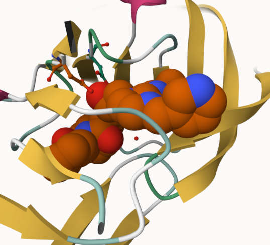
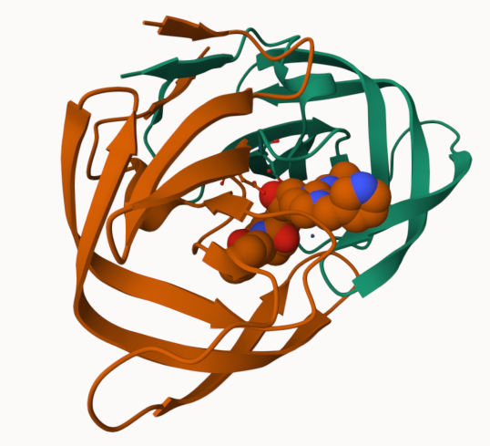

## Structural Bioinformatics (Pt. 1)

### 2. Introduction to the RCSB Protein Data Bank (PDB)

-   **Q1:** What percentage of structures in the PDB are solved by X-Ray and Electron Microscopy.

```{r}
# Read the CSV file into R
stats <- read.csv("pdb_stats.csv", row.names = 1)

stats
```

```{r}
# Function to remove commas and sum a column
comma_sum <- function(x) {
  # Remove commas, convert to numeric, then sum
  sum(as.numeric(gsub(",", "", x)))
}
```

```{r}
# Calculate totals for each method across all molecular types
xray_total <- sum(stats$X.ray)
em_total <- sum(stats$EM)
overall_total <- sum(stats$Total)

# Percentage for X-ray
xray_total / overall_total * 100
# Percentage for EM
em_total / overall_total * 100
```

> X-ray solved for 80.95% and EM accounts for 12.84% of all PDB structures.

-   **Q2:** What proportion of structures in the PDB are protein?

```{r}
# Protein-containing structures = Protein (only) + Protein/Oligosaccharide + Protein/NA
protein_total <- stats["Protein (only)", "Total"] +
                 stats["Protein/Oligosaccharide", "Total"] +
                 stats["Protein/NA", "Total"]

protein_total / overall_total * 100
```

> 97.91% of structures in the PDB contain protein.

-   **Q3:** Type HIV in the PDB website search box on the home page and determine how many HIV-1 protease structures are in the current PDB?

> There are 226 structures of HIV-1 protease structures in current PDB.

#save pic in text: \![title\](filename #(

### 3. Visualizing the HIV-1 protease structure

#### The important role of water

Toggle on the display of all water molecules again.

**Q4**: Water molecules normally have 3 atoms. Why do we see just one atom per water molecule in this structure?

> In X-ray crystallography, hydrogen atoms are generally not resolved because they have 1 electrons, making them nearly invisible to X-rays. Since the hydrogen atoms scatter X-rays too weakly to be detected at the 2 Angstrom resolution of this structure, only the oxygen atom of each water molecule is included in the PDB file.

**Q5**: There is a critical “conserved” water molecule in the binding site. Can you identify this water molecule? What residue number does this water molecule have

> Yes, he water molecule is HOH 308. This water molecule sits in the binding site and forms a hydrogen-bonding network that bridges the flaps of the protease dimer to the bound inhibitor.

**Q6**: Generate and save a figure clearly showing the two distinct chains of HIV-protease along with the ligand. You might also consider showing the catalytic residues ASP 25 in each chain and the critical water (we recommend *“Ball & Stick”* for these side-chains). Add this figure to your Quarto document.

  **Discussion Topic:** Can you think of a way in which indinavir, or even larger ligands and substrates, could enter the binding site?

**Q7**: \[Optional\] As you have hopefully observed HIV protease is a homodimer (i.e. it is composed of two identical chains). With the aid of the graphic display can you identify secondary structure elements that are likely to only form in the dimer rather than the monomer?

>  The four-stranded beta-sheet at the interface between the two chains is a key structural element that only forms in the dimer. It can close over the substrate/inhibitor binding site.

### 4. Introduction to Bio3D in R

-   **Q7:** How many amino acid residues are there in this pdb object?

```{r}
# Load the bio3d package
library(bio3d)
# Read the 1HSG PDB file from the online PDB database
# This downloads the file and parses it into an R object
pdb <- read.pdb("1HSG.pdb")
```

```{r}
# Print a summary of the PDB object
pdb
```

> There are 198 amino acid residues.

-   **Q8:** Name one of the two non-protein residues?

> The two non-protein residue types are HOH, water, 127 molecules, and MK1, 1 molecule.

-   **Q9:** How many protein chains are in this structure?

> There are 2 protein chains (A and B), as indicated by "Chains#: 2 (values: A B)".

```{r}
# View the attributes of the pdb object
attributes(pdb)

# Access the atom data
head(pdb$atom)
```

#### Quick PDB visualization in R

```{r}
# Install the visualization packages (run in Console)
# install.packages("remotes")
# remotes::install_github("bioboot/bio3dview")
# install.packages("NGLVieweR")

# Load the packages
library(bio3dview)
library(NGLVieweR)

# Basic spinning view of the structure
view.pdb(pdb) |>
  setSpin()
```

```{r}
# Custom view: color chains differently and highlight the catalytic Asp 25
sele <- atom.select(pdb, resno = 25)

view.pdb(pdb, cols = c("navy", "teal"),
         highlight = sele,
         highlight.style = "spacefill") |>
  setRock()
```

#### Predicting functional motions of a single structure

```{r}
# Read the Adenylate Kinase structure
adk <- read.pdb("6s36")
# Print summary
adk
```

```{r}
# Perform Normal Mode Analysis (NMA) to predict flexibility
# NMA uses an elastic network model to calculate the natural vibrations of the protein
m <- nma(adk)
# Generate a trajectory PDB file to visualize the predicted motion
# This creates a multi-model PDB file showing the protein "breathing"
mktrj(m, file = "adk_m7.pdb")
```

```{r, fig.width=10, fig.height=7}
par(mar=c(4, 4, 2, 2))  # bottom, left, top, right margins
# Plot the NMA results
# This shows eigenvalues, frequencies, and per-residue fluctuations
plot(m)
```

```{r}
# Or view directly in R using bio3dview
view.nma(m, pdb = adk)
```

### 5. Comparative structure analysis of Adenylate Kinase

-   **Q10.** Which of the packages above is found only on BioConductor and not CRAN?

> msa (Multiple Sequence Alignment). It must be installed via BiocManager::install("msa") rather than the standard install.packages().

-   **Q11.** Which of the above packages is not found on BioConductor or CRAN?:

> bio3dview. It is installed from GitHub using remotes::install_github("bioboot/bio3dview")

-   **Q12.** True or False? Functions from the pak package can be used to install packages from GitHub and BitBucket? TRUE FALSE

> TRUE. The pak package is a modern package manager for R that can install packages from CRAN, Bioconductor, GitHub, GitLab, and BitBucket.

#### Search and retrieve ADK structures

```{r}
library(bio3d)

# Fetch the sequence for chain A of PDB 1AKE (Adenylate Kinase from E. coli)
aa <- get.seq("1ake_A")
```

-   **Q13.** How many amino acids are in this sequence, i.e. how long is this sequence? 

```{r}

# View the sequence
aa
```

> #### View the sequence
>
> The sequence is 214 amino acids long, as shown by "214 position columns (214 non-gap, 0 gap)" in the output.

may time out:

```{r}
# Blast search the PDB database to find related structures
# This may time out due to server load — see the backup below
# b <- blast.pdb(aa)

# Plot and filter results
# hits <- plot(b)

# List top hits
# head(hits$pdb.id)

# use these pre-identified PDB IDs
hits <- NULL
hits$pdb.id <- c('1AKE_A','6S36_A','6RZE_A','3HPR_A','1E4V_A',
                  '5EJE_A','1E4Y_A','3X2S_A','6HAP_A','6HAM_A',
                  '4K46_A','3GMT_A','4PZL_A')
```

```{r}
# Download the PDB files for all hits
# split=TRUE extracts individual chains; gzip=TRUE compresses files
files <- get.pdb(hits$pdb.id, path = "pdbs", split = TRUE, gzip = TRUE)
# Align the structures using multiple sequence alignment
# fit=TRUE superimposes all structures onto a common reference frame
# exefile="msa" tells bio3d to use the Bioconductor msa package
pdbs <- pdbaln(files, fit = TRUE, exefile = "msa")
```

\^\^ upper step done=

(1) aligns the amino acid sequences to identify equivalent positions
(2)  superimposes the 3D coordinates so all structures overlap as much as possible. This is essential for comparing conformations.

#### Annotate collected PDB structures

```{r}
# Get annotation info (species, method, resolution, etc.) from PDB
ids <- basename.pdb(pdbs$id)
anno <- pdb.annotate(ids)

# See which species these structures come from
unique(anno$source)
```

```{r}
# View all annotation data
anno
```

#### Principal Component Analysis (PCA)

```{r}
# Perform PCA on the aligned structure ensemble
# PCA finds the directions of greatest structural variation
pc.xray <- pca(pdbs)

# Plot PCA results: shows PC1 vs PC2, PC3 vs PC2, and a scree plot
plot(pc.xray)
```

#### RMSD clustering and PCA visualization

```{r}
# Calculate all pairwise RMSD values between structures
rd <- rmsd(pdbs)

# Hierarchical clustering based on RMSD
hc.rd <- hclust(dist(rd))

# Cut into 3 groups
grps.rd <- cutree(hc.rd, k = 3)

# Plot PC1 vs PC2, colored by RMSD-based cluster
plot(pc.xray, 1:2, col = "grey50", bg = grps.rd, pch = 21, cex = 1)
```

#### PCA visualization

```{r}
# Generate a trajectory along PC1 to visualize the dominant motion
pc1 <- mktrj(pc.xray, pc = 1, file = "pc_1.pdb")
```

```{r}
library(ggplot2)
library(ggrepel)

# Create a dataframe for ggplot
df <- data.frame(
  PC1 = pc.xray$z[, 1],
  PC2 = pc.xray$z[, 2],
  col = as.factor(grps.rd),
  ids = ids
)

# Create the plot with labeled points
p <- ggplot(df) +
  aes(PC1, PC2, col = col, label = ids) +
  geom_point(size = 2) +
  geom_text_repel(max.overlaps = 20) +
  theme(legend.position = "none")
p
```

### 6. Normal mode analysis \[optional\]

-   **Q14;** What do you note about this plot? Are the black and colored lines similar or different? Where do you think they differ most and why?

```{r}
# Perform NMA on ALL structures in the ensemble
modes <- nma(pdbs)
# Plot fluctuation profiles, colored by RMSD cluster
plot(modes, pdbs, col = grps.rd)
```

> The black lines (ligand-bound group) and the colored lines (ligand-free group) show similar overall fluctuation patterns. It means the same residues tend to be flexible or rigid across all structures. Yet, they differ most in two regions: around residues 30-65 (the "lid" domain) and residues 125-165 (the "NMP-binding" domain). In the open conformation, these regions show larger fluctuations, while in the black lines, these same regions are more rigid because nucleotide binding stabilizes them. These are the two mobile domains that clamp down on the substrates during catalysis.
