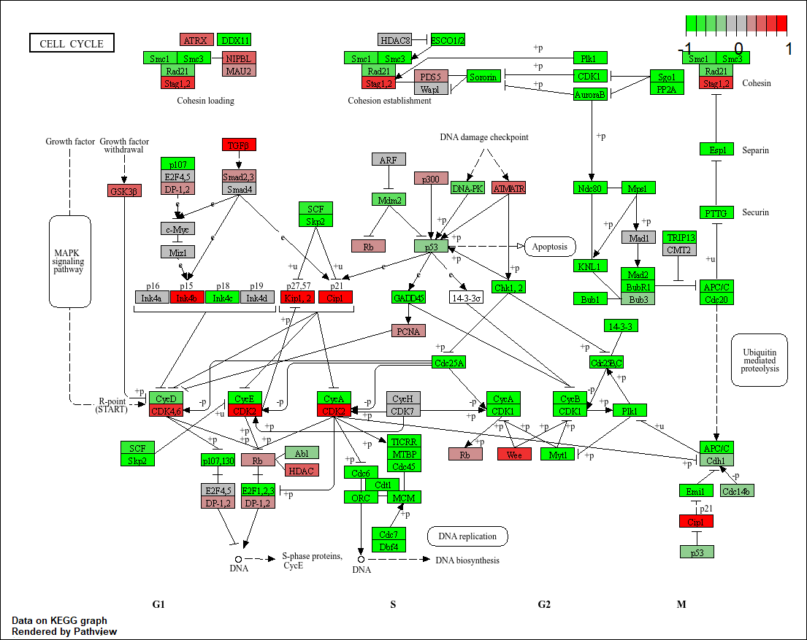
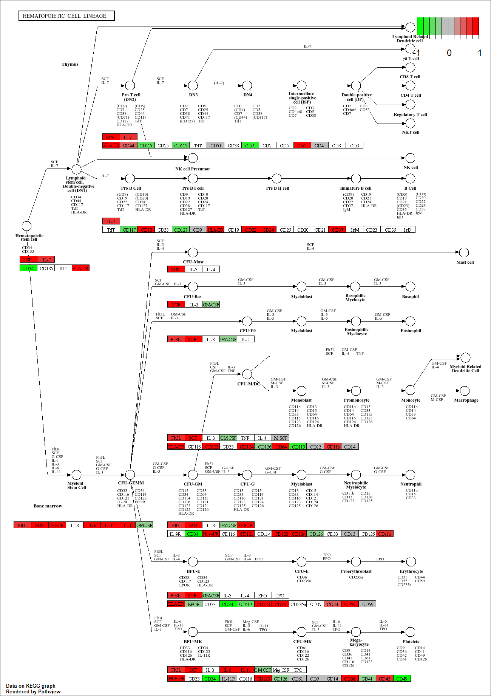
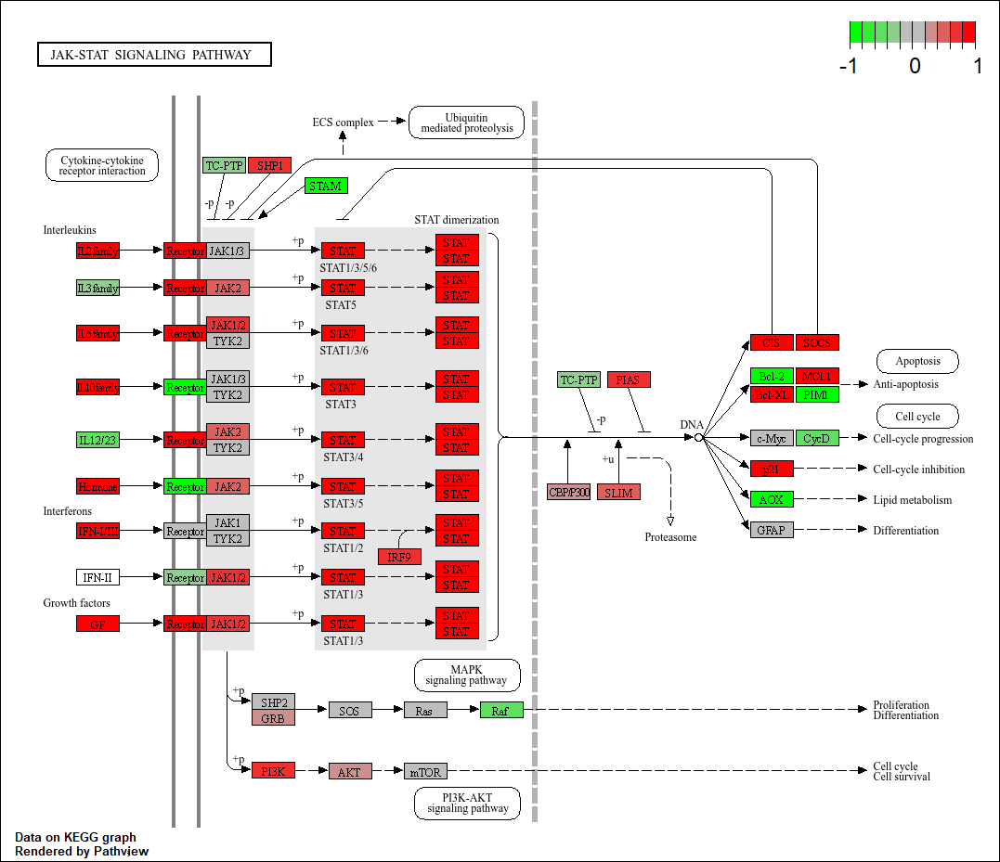
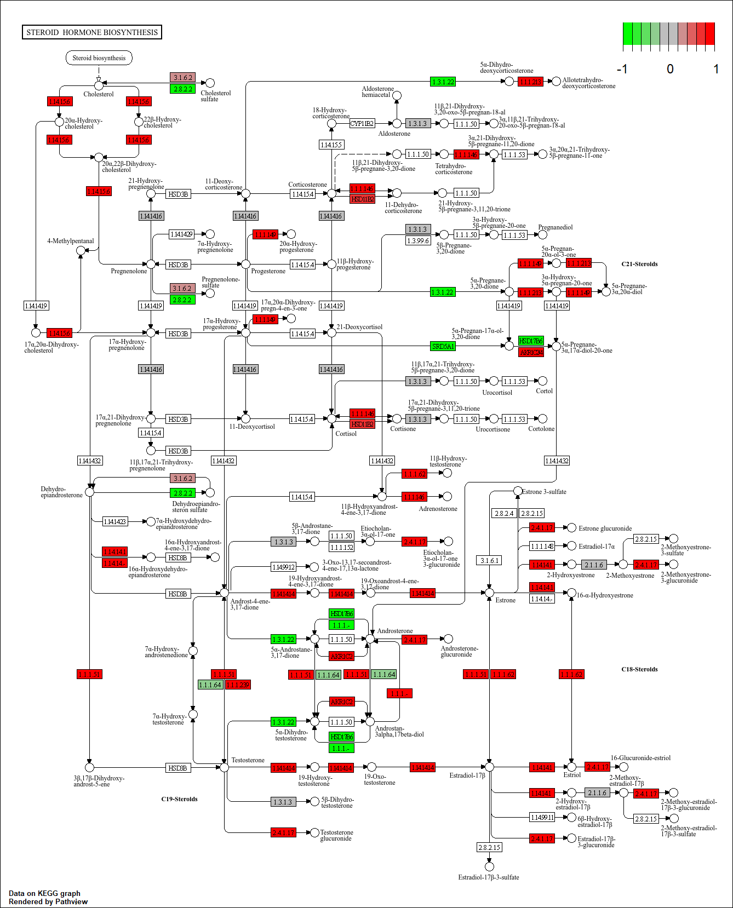
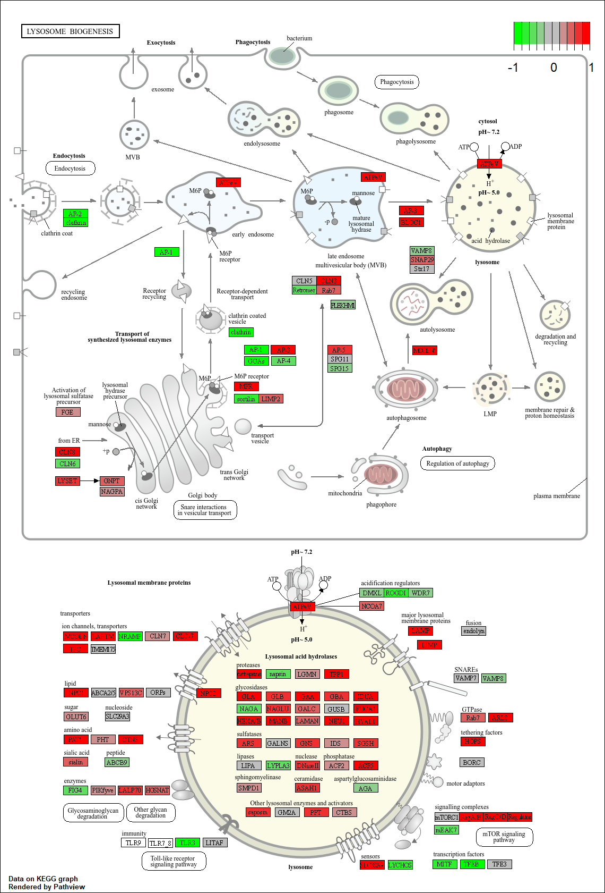
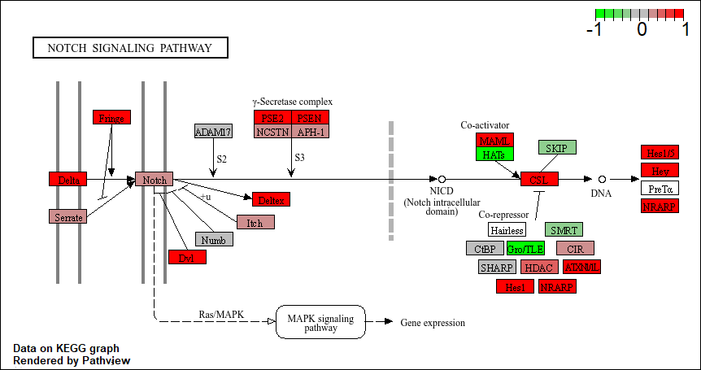
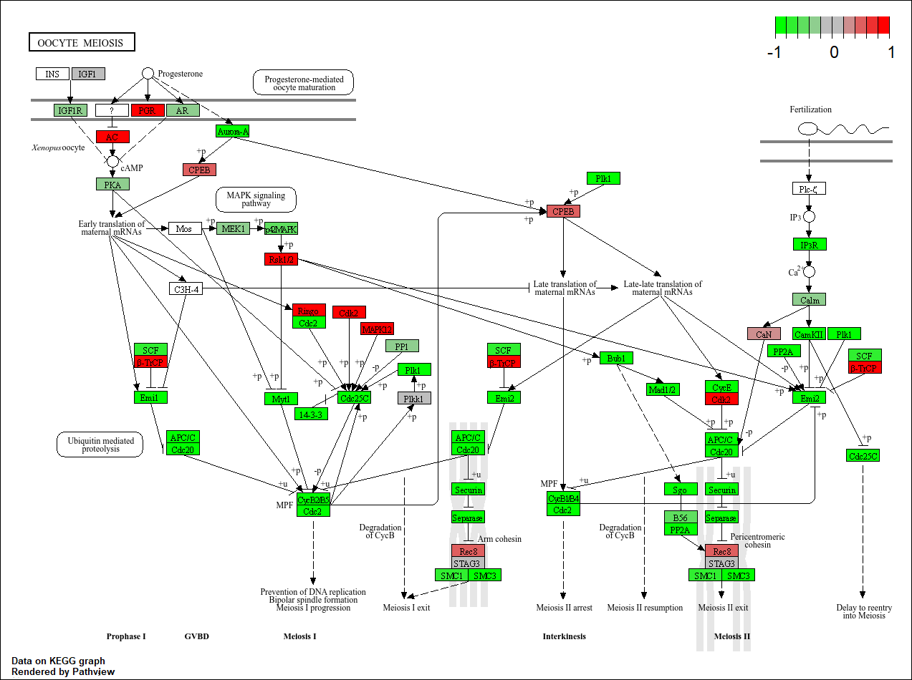

### Section 1. Differential Expression Analysis

```{r}
library(DESeq2)
```

```{r}
metaFile <- "GSE37704_metadata.csv"
countFile <- "GSE37704_featurecounts.csv"

# Import metadata and take a peek
colData = read.csv(metaFile, row.names=1)
head(colData)

# Import countdata
countData = read.csv(countFile, row.names=1)
head(countData)
```

**Q**. Complete the code below to remove the troublesome first column from `countData`

```{r}
countData <- as.matrix(countData[, -1])
head(countData)
```

countData\[, -1\] means "all rows, all columns except the first." The length column is gene length metadata, not expression counts.

**Q**. Complete the code below to filter `countData` to exclude genes (i.e. rows) where we have 0 read count across all samples (i.e. columns).

Tip: What will **rowSums()** of `countData` return and how could you use it in this context?

```{r}
countData <- countData[rowSums(countData) > 1, ]
head(countData)
```

rowSums(countData) \> 0 creates a logical vector that is TRUE for genes with at least one read across all samples

#### Running DESeq2

```{r}
dds <- DESeqDataSetFromMatrix(countData = countData,
                               colData = colData,
                               design = ~condition)
dds <- DESeq(dds)
dds
```

**Q**. Call the **summary()** function on your results to get a sense of how many genes are up or down-regulated at the default 0.1 p-value cutoff.

```{r}
res <- results(dds)
summary(res)
```

#### Volcano Plot

```{r}
library(ggplot2)

ggplot(as.data.frame(res)) +
  aes(log2FoldChange, -log10(padj)) +
  geom_point()
```

Q. Improve this plot by completing the below code, which adds color, axis labels and cutoff lines:

```{r}
# Make a color vector for all genes
mycols <- rep("gray", nrow(res))

# Color blue the genes with absolute fold change above 2
mycols[abs(res$log2FoldChange) > 2] <- "blue"

# Color back to gray those with adjusted p-value more than 0.01
mycols[res$padj > 0.01] <- "gray"

ggplot(as.data.frame(res)) +
  aes(log2FoldChange, -log10(padj)) +
  geom_point(col = mycols) +
  xlab("Log2(FoldChange)") +
  ylab("-Log(P-value)") +
  geom_vline(xintercept = c(-2, 2)) +
  geom_hline(yintercept = -log10(0.01))
```

#### Adding gene annotation

> **Q**. Use the **mapIDs()** function multiple times to add SYMBOL, ENTREZID and GENENAME annotation to our results by completing the code below.

```{r}
library("AnnotationDbi")
library("org.Hs.eg.db")

res$symbol <- mapIds(org.Hs.eg.db,
                     keys = row.names(res),
                     keytype = "ENSEMBL",
                     column = "SYMBOL",
                     multiVals = "first")

res$entrez <- mapIds(org.Hs.eg.db,
                     keys = row.names(res),
                     keytype = "ENSEMBL",
                     column = "ENTREZID",
                     multiVals = "first")

res$name <- mapIds(org.Hs.eg.db,
                   keys = row.names(res),
                   keytype = "ENSEMBL",
                   column = "GENENAME",
                   multiVals = "first")

head(res, 10)
```

Q. Finally for this section let's reorder these results by adjusted p-value and save them to a CSV file in your current project directory.

```{r}
res <- res[order(res$pvalue), ]
write.csv(as.data.frame(res), file = "deseq_results.csv")
```

### Section 2. Pathway Analysis

#### KEGG pathways

```{r}
# One-time install (run in console, not in .qmd):
# BiocManager::install(c("pathview", "gage", "gageData"))

library(pathview)
library(gage)
library(gageData)

data(kegg.sets.hs)
data(sigmet.idx.hs)

# Focus on signaling and metabolic pathways only
kegg.sets.hs <- kegg.sets.hs[sigmet.idx.hs]

# Examine the first 3 pathways
head(kegg.sets.hs, 3)
```

Prepare input: named vector of fold changes

```{r}
foldchanges <- res$log2FoldChange
names(foldchanges) <- res$entrez
head(foldchanges)
```

Run gage pathway analysis

```{r}
keggres <- gage(foldchanges, gsets = kegg.sets.hs)
attributes(keggres)
```

Look at top down-regulated pathways

```{r}
head(keggres$less)
```

Generate pathview plots

```{r}
# Cell cycle pathway
pathview(gene.data = foldchanges, pathway.id = "hsa04110")
```

```{r}
# PDF version
pathview(gene.data = foldchanges, pathway.id = "hsa04110", kegg.native = FALSE)
```



Plot top 5 upregulated pathways

```{r}
keggrespathways <- rownames(keggres$greater)[1:5]
keggresids <- substr(keggrespathways, start = 1, stop = 8)
keggresids

pathview(gene.data = foldchanges, pathway.id = keggresids, species = "hsa")
```

{width=100%}

{width=100%}

{width=100%}

{width=100%}

{width=100%}
#### Q. Plot top 5 down-regulated pathways

Same procedure but with `keggres$less`:

Q. Can you do the same procedure as above to plot the pathview figures for the top 5 down-regulated pathways?

```{r}
keggrespathways_down <- rownames(keggres$less)[1:5]
keggresids_down <- substr(keggrespathways_down, start = 1, stop = 8)
keggresids_down

pathview(gene.data = foldchanges, pathway.id = keggresids_down, species = "hsa")
```

{width=100%}

{width=100%}

{width=100%}

{width=100%}

{width=100%}
### Section 3. Gene Ontology (GO)

```{r}
data(go.sets.hs)
data(go.subs.hs)

# Focus on Biological Process subset of GO
gobpsets <- go.sets.hs[go.subs.hs$BP]

gobpres <- gage(foldchanges, gsets = gobpsets)
lapply(gobpres, head)
```

### Section 4. Reactome Analysis

```{r}
sig_genes <- res[res$padj <= 0.05 & !is.na(res$padj), "symbol"]
print(paste("Total number of significant genes:", length(sig_genes)))
```

```{r}
write.table(sig_genes, file = "significant_genes.txt",
            row.names = FALSE, col.names = FALSE, quote = FALSE)
```

**Q**: What pathway has the most significant “Entities p-value”? Do the most significant pathways listed match your previous KEGG results? What factors could cause differences between the two methods?

> Cell Cycle (R-HSA-1640170) has the most significant Entities p-value at 2.68e-05, with 493 out of 729 entities found. The second most significant is Cell Cycle, Mitotic (R-HSA-69278) at p = 2.83e-05.
>
> Yes, they match very well. In the KEGG/gage analysis, the top downregulated pathway was hsa04110 Cell Cycle (p ≈ 1e-05), and here in Reactome the top hit is also Cell Cycle. Several other overlapping themes appear in both analyses: DNA replication, cell cycle checkpoints, and mitotic processes which are all consistent with HOXA1's known role in cell cycle progression.
>
> The factors that lead to the differences might be different pathway databases, statistical approaches, ID mapping and gene universes and multiple testing corrections.

### Section 5. GO online (OPTIONAL)

Q: What pathway has the most significant “Entities p-value”? Do the most significant pathways listed match your previous KEGG results? What factors could cause differences between the two methods?

> The most significant biological process terms by raw p-value are broad umbrella terms like metabolic process (p = 2.61e-135) and cellular process (p = 8.51e-134). Looking at specific and biologically meaningful terms, cell cycle-related processes dominate: regulation of cell cycle (GO:0051726, p = 1.38e-50), mitotic cell cycle (GO:0000278, p = 5.05e-50), mitotic cell cycle process (GO:1903047, p = 1.97e-48), and chromosome segregation (GO:0007059, p = 3.56e-22).
>
> Yes, these results strongly match the previous KEGG analysis. KEGG identified Cell Cycle (hsa04110) as the top downregulated pathway, Reactome also ranked Cell Cycle first (p = 2.68e-05), and here the GO analysis confirms that mitotic cell cycle, cell cycle regulation, DNA replication, and chromosome segregation are all highly enriched. All three methods converge on the same conclusion: loss of HOXA1 predominantly disrupts cell cycle and mitotic processes.
>
> > The factors that lead to the differences might be GO uses a hierarchical ontology and KEGG defines flat, discrete pathway maps with interaction information. Also statistical approaches differ and GO has broader annotation coverage than KEGG, so it captures more general biological processes. GO results contain substantial redundancy (e.g., "mitotic cell cycle" and "mitotic cell cycle process" share nearly the same genes), which does not occur in KEGG. The different multiple testing correction procedures and different numbers of tested categories affect which results pass significance thresholds.
